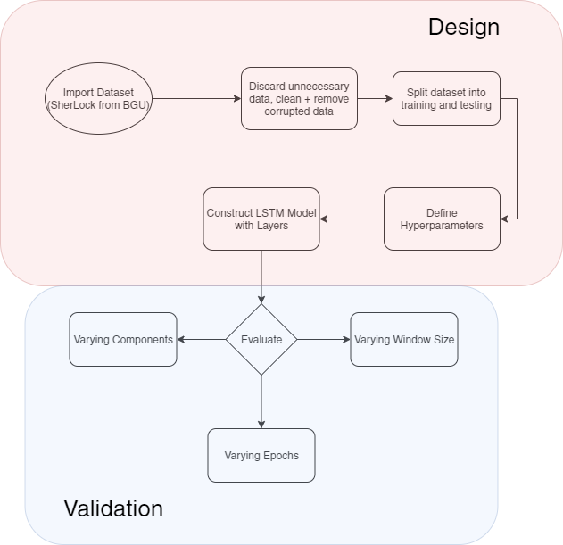

# LSTM Based Passive Smartphone Malware Detection 

## Introduction

The main goal of this project is to be able to validate the idea of a low-resource consumptive method of malware detection. By analyzing the behavioural patterns of a smarpthone or IoT device, is it possible to determine the existence of malware. 

The project uses time sequence classification to train an LSTM model. The input data for training includes the response of various device parameters (CPU consumption, memory usage, RX/TX for mobile/WiFi, etc) and maps them to whether a malicious attack vector is acting on the device. 

Evaluating the model is done by running the test data and comparing the model generated outputs (a 1 for "yes there is malware in this timeframe" or a 0 for "no there is no malware here") against the known outputs. 

## Program Flow

